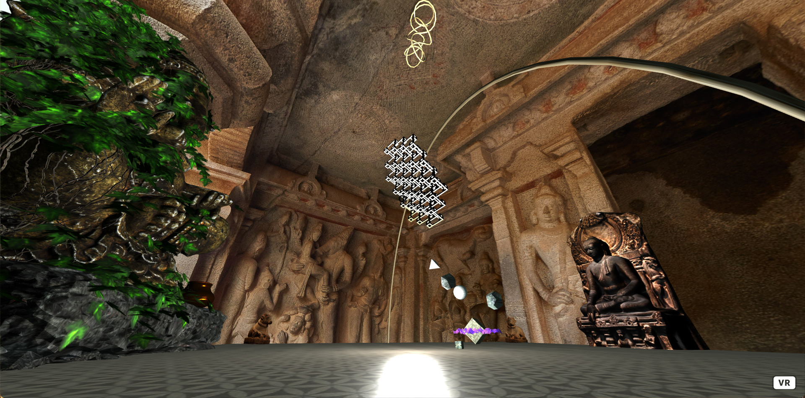

# Temple VR
Build this at an internal Rehive hackathon with (networked-aframe)[https://github.com/networked-aframe/networked-aframe#readme]
Multi player networking and voice chat is working.

## Local development
`npm run watch`
`npm run dev`

## Prod
`npm run start`

*Better to run with PM2 and nginx*

## Preview

